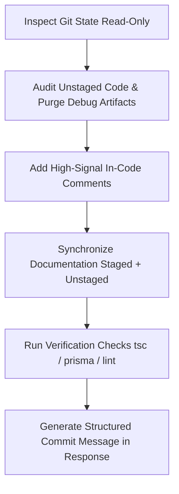

# Code Cleanup & Commit Preparation Skill

A standardized post-implementation review workflow designed to run immediately after making code changes. It audits modified files, removes temporary debug artifacts, ensures clear and balanced comments, synchronizes all affected markdown documentation (`AGENTS.md`, `.ai/`, and component docs), strictly preserves Git staging status without executing Git mutation commands, and formulates a ready-to-use Git commit message.

---

## Core Mandates & Guardrails

1. **Audit Unstaged Changes & Eliminate Debug Artifacts:**
   Inspect all unstaged diffs. Determine whether each modification is required and intentional. Identify and purge temporary debugging logs, scratch logic, dead/commented-out code, and temporary test mocks.
2. **Adequate & High-Signal Comments:**
   Add concise, high-value comments to clarify non-obvious logic, concurrency, VRAM/hardware constraints, domain rules, and error handling. Avoid redundant or overly verbose comments.
3. **Documentation Synchronization (Staged & Unstaged):**
   Review both staged and unstaged changes together. When architectural patterns, APIs, workflows, database models, worker cron routines, or configs change, update the corresponding markdown documentation files (`AGENTS.md`, `.ai/*.md`, and component docs).
4. **Strict Git Staging Preservation (NO Git Mutation Commands):**
   **NEVER** run commands that modify Git staging or working tree status (such as `git add`, `git stage`, `git reset`, `git restore --staged`, `git commit`, `git checkout`, `git rm`). Files that are staged must remain staged. Files that are unstaged must remain unstaged. Edits must be performed solely via workspace file tools (`replace_file_content`, `multi_replace_file_content`, `write_to_file`).
5. **Formulate a Production Git Commit Message:**
   Provide a polished, conventional Git commit message in the response for the user to review and execute when ready.

---

## Invocation Contract

Trigger this skill after implementing features, fixes, or refactors, or upon explicit user request:

### Example Triggers:
- "Clean up code"
- "/cleanup-code"
- "Audit my changes and prepare a commit message"
- "Review unstaged changes, clean up debug logs, and sync docs"
- "Post-implementation cleanup"

---

## Execution Workflow

Execute the following stages in order:



### Stage 1: Inspect Git State (Read-Only)

1. **Check Status:**
   Run read-only inspection commands to identify staged and unstaged files:
   ```powershell
   git status --short
   ```
2. **Inspect Unstaged Diff:**
   ```powershell
   git diff
   ```
3. **Inspect Staged Diff:**
   ```powershell
   git diff --cached
   ```
4. **Identify Untracked Artifacts:**
   Check untracked files (`??`) to verify if any are scratch files, temporary test outputs, or forgotten source files that belong to the change.

> [!CAUTION]
> **Strict Guardrail**: Only execute read-only Git query commands (`git status`, `git diff`). Never run `git add`, `git reset`, or `git commit`.

---

### Stage 2: Audit Unstaged Code & Purge Debug Artifacts

Examine all unstaged changes file-by-file:

1. **Check Necessity & Intent:**
   - Verify every modified line against the primary feature/fix objective.
   - If an unstaged modification is accidental, unintended formatting churn, or unrelated noise, revert that specific change using file replacement tools.
2. **Purge Debugging Code:**
   - Remove diagnostic console statements: `console.log(...)`, `console.dir(...)`, `print(...)`, `debugger;`.
   - Remove temporary test mocks, bypass flags, dummy IDs, or local hardcoded overrides.
   - Remove blocks of dead, commented-out code left over from experimentation.
   - Clean up unused imports, scratch variables, or dead helper functions.
3. **Validate Clean Structure:**
   - Ensure imports are cleanly ordered and types adhere strictly to TypeScript rules (`strict: true`, no `any` types).

---

### Stage 3: Add Adequate & High-Signal Comments

Ensure code maintainability following the **Goldilocks Commenting Standard**:

#### What to Comment (High-Signal):
- **Architectural & Design Decisions:** Explain *why* a particular approach was chosen over standard alternatives.
- **Hardware & VRAM Constraints:** Note single-GPU lock requirements, VRAM unloading/loading sequences, or model lifecycle quirks.
- **Tricky Logic & Edge Cases:** Explain complex regex patterns, mathematical scaling (e.g., coordinate letterboxing, FFmpeg filter graphs), or unusual timing boundaries.
- **Error Handling & Fallbacks:** Explain why specific errors are caught, swallowed, or retried, and what fallback path is triggered.
- **Public APIs & Methods:** Provide concise JSDoc/TSDoc for new or updated service methods, API request/response handlers, and worker functions.

#### What NOT to Comment (Low-Signal Noise):
- Do not state the obvious (e.g., `// loop through items`, `// return true`, `// set status to PENDING`).
- Do not leave conversational notes (e.g., `// Added by AI assistant`, `// Fix for bug as discussed`).
- Avoid multi-paragraph essays in code comments; keep them succinct and direct.

---

### Stage 4: Synchronize Documentation (Staged + Unstaged)

Synthesize the combined impact of **both staged and unstaged** changes, and update affected documentation files:

1. **Repository Core Instructions ([AGENTS.md](file:///e:/Video%20creation/AGENTS.md)):**
   - Check if project architecture, tech stack, new CLI commands, database policies, or phase workflows changed.
   - Update summaries and verification instructions if needed.
2. **System & Pipeline Specs ([.ai/](file:///e:/Video%20creation/.ai/)):**
   - [pipeline-execution.md](file:///e:/Video%20creation/.ai/pipeline-execution.md): Single-GPU phase coordination, model endpoints, or pipeline stages.
   - [architecture.md](file:///e:/Video%20creation/.ai/architecture.md): Service separation, database models, directory map.
   - [dos-and-donts.md](file:///e:/Video%20creation/.ai/dos-and-donts.md): New architectural patterns or prohibited practices.
   - [shorts-pipeline.md](file:///e:/Video%20creation/.ai/shorts-pipeline.md): Vertical shorts generation, Whisper transcription, or safe-zone rules.
3. **Subsystem & Component Docs:**
   - Update markdown docs associated with modified components (e.g., `src/cron/crons.md`, `src/services/*.md`, `src/utils/*.md`, `video-upscaler/*.md`, `comfyui-*/setup-*.md`).
4. **Link Integrity:**
   - Always ensure links in markdown use the standard GitHub markdown format with `file://` scheme and forward slashes.

---

### Stage 5: Verification Checks

Before finalizing, verify that cleanups introduced no regressions or type errors:

1. **TypeScript Type Check:**
   ```powershell
   npx tsc --noEmit
   ```
2. **Prisma Schema Check (if `schema.prisma` was modified):**
   ```powershell
   npx prisma validate
   ```
3. **Linting Check (if configured):**
   ```powershell
   npm run lint
   ```

If any errors occur, resolve them using file editing tools without modifying Git staging.

---

### Stage 6: Formulate and Output Git Commit Message

Construct a conventional commit message encapsulating both staged and unstaged work:

- **Format:** `<type>(<scope>): <concise subject in imperative mood>`
  - Types: `feat`, `fix`, `refactor`, `perf`, `docs`, `chore`, `test`
  - Scope: Component or subsystem (e.g., `worker`, `api`, `shorts`, `upscaler`, `subtitles`, `tts`, `db`)
- **Body Structure:**
  - Brief rationale/context of the changes.
  - Bulleted summary of functional modifications and improvements.
  - Summary of cleanup actions (removed debug code, added comments).
  - Summary of updated documentation files.

---

## Standard Output Format

When completing the skill execution, present the report to the user with the following sections:

````markdown
### Code Audit & Cleanup Summary
- **Unstaged Files Inspected:** [List of files and confirmed necessity]
- **Debug Artifacts Removed:** [List of removed logs, dead code, temporary mocks]
- **Comments Added:** [Summary of key areas commented for clarity]

### Documentation Updates
- [List of markdown files updated with links, e.g., AGENTS.md, .ai/... ]

### Verification Status
- `npx tsc --noEmit`: Passed
- `npx prisma validate`: Passed (or Skipped if schema untouched)

### Recommended Git Commit
```bash
git commit -m "<type>(<scope>): <subject line>" -m "<detailed description of changes>

- <Key change 1>
- <Key change 2>
- Updated documentation in <file list>"
```
````
